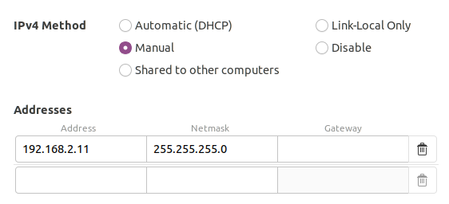

# ROS Package for Kinova Motion Planning
---
## Instructions
#### Connecting to the Kinova Arm:
1. Install all necessary software as defined in the Kinova Kortex [GitHub](https://github.com/Kinovarobotics/ros_kortex).
2. Turn on the Kinova arm and attach the ethernet cord from the arm to the laptop.
3. Configure the IPv4 wired network settings of the laptop properly as shown in the image below. The first three numbers of the Address should match the robot's IP address and the last number should be different. In this examples the robot's IP is 192.168.2.10.

4. To run the ROS Driver on the Kinova arm:
    ```
    roslaunch kortex_driver kortex_driver.launch ip_addres:=192.168.2.10 dof:=6 gripper:=robotiq_2f_85` 
    ```

#### Running the Code:
This ROS package works in conjuction with other packages to initiate the manipulation service server. A series of steps must be followed to run the full capabilities of this code. The other launch files and packages can be found in other repositories on the GetAGrip-dot-Ai [GitHub](https://github.com/Kinovarobotics/ros_kortexhttps://github.com/GetAGrip-dot-Ai).
1. Launch the Kinova ROS driver from step 4 above and launch the script to provide TF frames using calibrated camera values. The following command can be run to launch both these files.
    ```
    roslaunch pepper_ws kinova_real.launch
    ```
2. Launch the manipulation ROS package
    ```
    roslaunch manipulation manipulator.launch
    ```
3. To include perception capabilities, a realsense camera with must be attached to the laptop and the following files must be launched. The camera should be calibrated beforehand with the correct transformation values saved in the pepper_ws repository.
    ```
    rosrun pepper_ws visual_servoing_service.py
    rosrun pepper_ws multi_frame_service.py
    ```
4. Launch the system node:
    ```
    roslaunch system_ws system.launch
    ```
---

## Manipulation Service State Machine ##

Below is an explanation of the different states in the harvest service callback. The system-level state machine is dictated by the harvest service client. This manipulation package creates a harvest service server to communicate with the system. A subsystem-level internal state machine was created here to define the actions needed to be taken by the manipulation subsystem for each of the system-level states.
- **CASE 0:** Move to Reset Pose
- **CASE 1:** Approach Plant Positions
- **CASE 2:** Multiframe Moves
- **CASE 3:** Create Obstacles & Move to Pre-Grasp POI
- **CASE 7:** Move to Basket Drop and Remove Obstacles
- **CASE 10:** Visual Servoing
- **CASE 15:** Increment Approach Position


